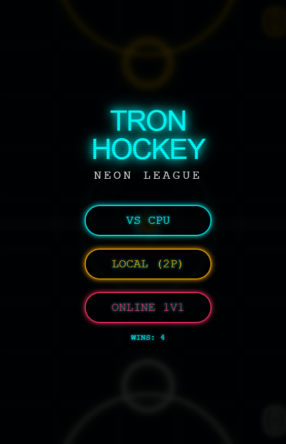
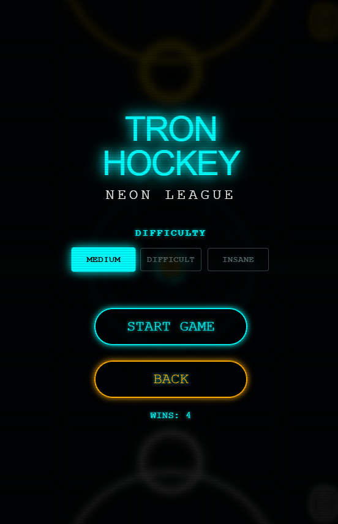
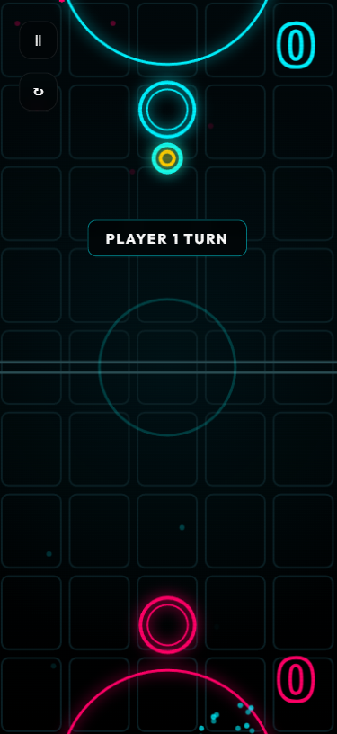
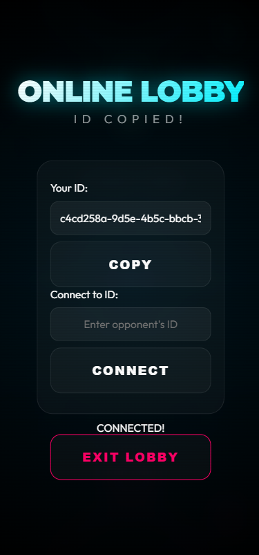

# 🏒 Tron Hockey

A visually stunning, fast-paced air hockey game built with modern web technologies. Experience the thrill of neon-soaked arcade action right in your browser or installed as a PWA.

<p align="center">
  
  
</p>
<p align="center">
  
  
</p>

## ✨ Key Features

### 🎮 Game Modes
*   **Single Player (vs CPU)**: Challenge an AI opponent with three tiers of difficulty:
    *   **Medium**: Good for warming up.
    *   **Difficult**: A solid challenge for casual players.
    *   **Insane**: An aggressive, predictive AI that will test your reflexes.
*   **Local Multiplayer**: Play with a friend on the same device using split-screen touch controls.
*   **Online Multiplayer**: Connect with a friend anywhere in the world instantly.

### 🌐 Seamless Online Experience
*   **Instant Connection**: Host a game and share a simple link (or scan a QR code if you add one!) to play.
*   **True Perspective Rendering**: No matter which side you play on, the game renders **YOU** at the bottom. No upside-down UI or awkward text flipping.
*   **Robust Networking**: Built on **PeerJS** for direct peer-to-peer low-latency gaming. Includes features like persistent Identity (links don't expire on reload) and connection loss handling.

### 🎨 Visual & Audio Immersion
*   **Neon Aesthetics**: Glowing pucks, paddles, and field lines inspired by Tron.
*   **Dynamic Particles**: Spark effects on collisions and wall hits.
*   **Responsive Design**: scales perfectly from mobile phones to desktop monitors.
*   **Sound Effects**: Satisfying collision and goal sounds (AudioContext API).

### 📱 Progressive Web App (PWA)
*   **Installable**: Add to your home screen and play like a native app.
*   **Offline Capable**: Playing Local or vs CPU? No internet required after the first load.

## 🛠️ Tech Stack using Vanilla JS
*   **Frontend**: HTML5 Canvas, Vanilla JavaScript (ES6+), CSS3 Variables.
*   **Networking**: [PeerJS](https://peerjs.com/) (WebRTC wrapper).
*   **Build Tool**: NPM Scripts + `javascript-obfuscator` for code protection.

## 🚀 How to Run

1.  **Install Dependencies**:
    ```bash
    npm install
    ```

2.  **Run Locally (Dev)**:
    Serve the project root with any static server (e.g., Live Server).

3.  **Build for Production**:
    This commands bundles assets into `public/` and obfuscates the code.
    ```bash
    npm run build
    ```

4.  **Deploy (Firebase)**:
    ```bash
    firebase deploy
    ```

## 🕹️ Controls
*   **Mouse/Touch**: Drag to move your paddle.
*   The paddle responds 1:1 to your movement but is constrained to your half of the field.

## 🔒 Security
The project includes a build step that **obfuscates** the core game logic (`script.js`) before deployment, protecting your source code from casual inspection.

---
*Created with ❤️ by Anoobiex
